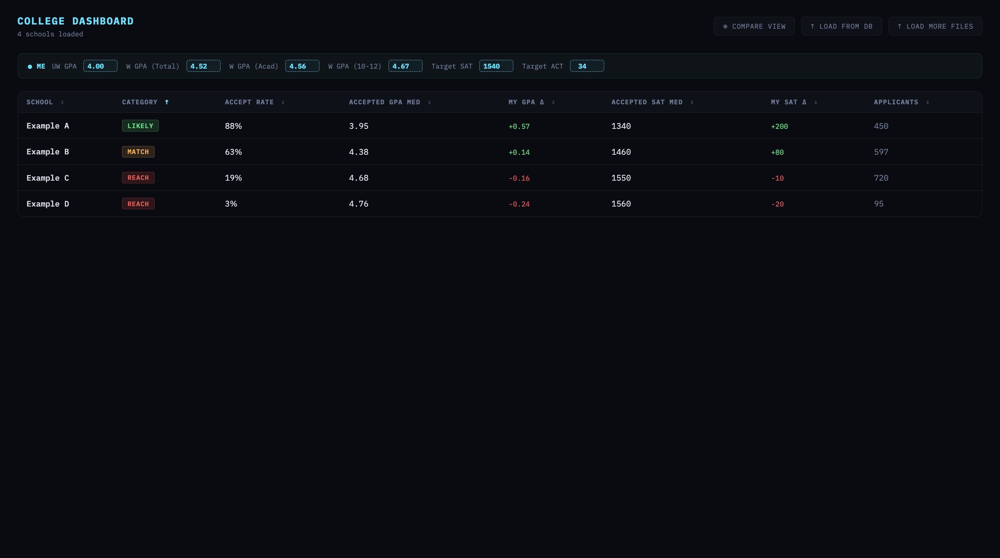
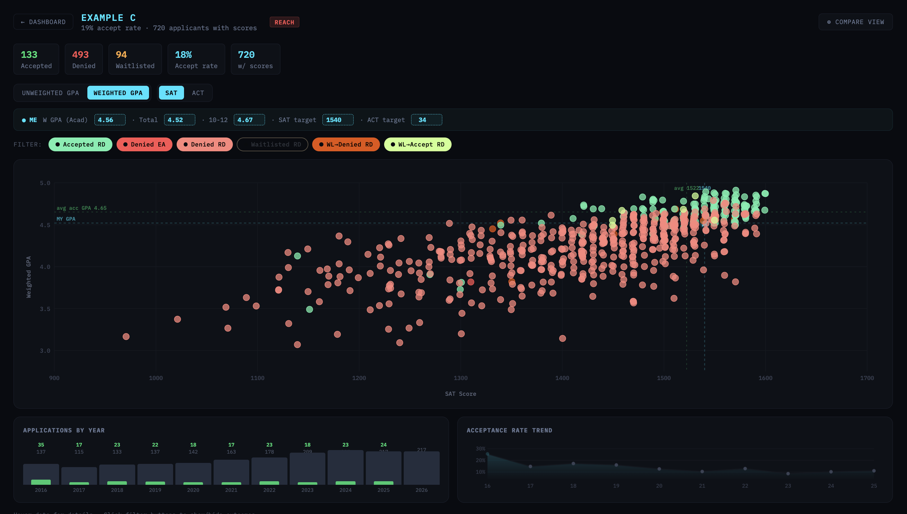
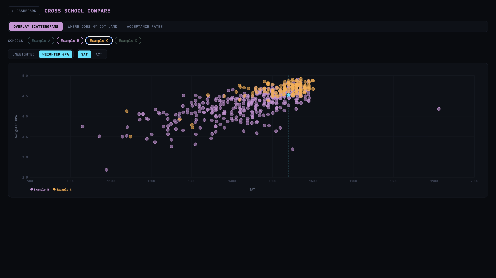

# Naview

**A free Chrome extension that helps students turn school-specific Naviance data into clearer college planning decisions.**

Naview makes scattergram data easier to access, understand, and act on. It is built for students who want to organize their college search, build balanced college lists, and prepare for applications using information specific to their own high school.

The goal is simple: make useful college planning information more accessible, especially for students who cannot afford private college counselors.

## Why This Matters

Many students already have access to valuable historical admissions data through Naviance, but the interface can make it hard to compare schools, track patterns, or use the data while building a college list. Students with private counselors often get help interpreting this information. Students without that support are left to manually inspect scattergrams one school at a time.

Naview helps close that gap by turning the data a student already has access to into a searchable, visual, local dashboard.

## What It Does

- Captures Naviance scattergram data from college pages.
- Saves schools locally in the browser, so students can build a reusable college database.
- Shows a quick summary panel on Naviance pages.
- Lets students compare colleges side by side.
- Helps organize reach, target, and likely schools using school-specific admissions history.
- Exports data as JSON or CSV for further analysis.
- Keeps data on the student's device.

## Screenshots

### College List View

Browse saved colleges, scan high-level stats, and keep a working list of schools in one place.



### Single College View

Inspect one school in detail, including applicant outcomes, score ranges, and school-specific historical context.



### Compare View

Compare multiple colleges side by side to make a more balanced application list.



## Built For

- Students planning college applications without private counseling support.
- Students comparing many colleges across reach, target, and likely categories.
- Families who want a clearer view of school-specific admissions history.
- Developers or counselors who want local, exportable data instead of manual screenshots.

## Privacy First

Naview stores parsed scattergram data locally in the browser with IndexedDB. It does not upload scattergram data to a server.

The primary parser uses the Naviance page's local network responses. An optional fallback parser is designed around Chrome built-in AI APIs if available, but the app does not require AI for its core workflow.

## How It Works

```text
Naviance college page
  -> extension detects scattergram data
  -> parser normalizes the response
  -> IndexedDB stores one local record per school
  -> dashboard turns saved records into list, detail, and compare views
```

The parser uses three tiers:

- Tier 1: parse the raw Naviance API response.
- Tier 2: scrape the page DOM if a network response was missed.
- Tier 3: use Chrome built-in AI as a fallback for future page/API changes.

## Tech Stack

- Chrome Extension Manifest V3
- JavaScript modules
- esbuild
- IndexedDB
- Jest

## Development

Prerequisites:

- Node.js 19+
- Google Chrome with extension developer mode enabled

Install dependencies:

```bash
npm install
```

Run tests:

```bash
npm test
```

Build the bundled content script:

```bash
npm run build
```

During development:

```bash
npm run build:watch
```

## Load the Extension

1. Run `npm run build`.
2. Open `chrome://extensions`.
3. Enable Developer Mode.
4. Click **Load unpacked**.
5. Select this repository folder.
6. Visit a Naviance college scattergram page.

Click the extension icon to open the dashboard viewer.

## Project Structure

```text
naview/
├── manifest.json
├── background/
├── content/
├── parser/
├── ui/
├── export/
├── storage/
├── tests/
└── readme_assets/
```

## Packaging

Create a lightweight release zip without `node_modules`, test fixtures, or git metadata:

```bash
npm run package
```

The release archive is written to `naview-release.zip`.
